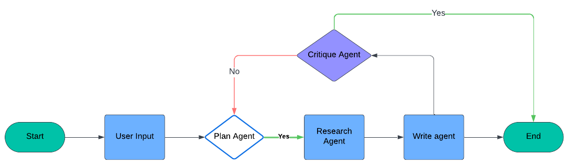

# Personalized Meal Planner

A system that helps users plan meals based on dietary preferences, nutritional requirements, and available ingredients. Due to insufficient funds, the AI agents can be slow sometimes. 😢

## 🔍 Project Overview

This project utilizes a team of AI agents to generate personalized meal plans collaboratively. The agents use the LangGraph framework and Tavily API to achieve their goals.

[LangGraph Library](https://github.com/langchain-ai/langgraph)

## Agents

1. **Meal Planner Agent**: Responsible for creating an initial meal plan outline based on the user's task description.
2. **Meal Plan Generator Agent**: Generates a detailed meal plan based on the initial outline and the gathered research content.
3. **Reflect Meal Plan Agent**: Generates a list of search queries to gather additional information needed to make any requested revisions based on the critique.
4. **Meal Plan Researcher Agent**: Generates a list of search queries to gather relevant information (such as calories, protein, ingredients, and recipes) needed to create a detailed meal plan. Researches Meal plan based on generated search query.
5. **Meal Plan Critique Agent**: Reviews the detailed meal plan draft and provides critique and recommendations for improvement.

## Flow Chart



## Demo


## 🚀 Setup

1. Clone the repository:
    ```Terminal
    git clone https://github.com/yourusername/personalized-meal-planner.git
    cd AI-AGENT-MEAL-PLANNER
    ```


2. Install the dependencies:
    ```Terminal
    pip install -r requirements.txt
    If error presists Please check your the python that is donwloaded. 
    It should be Python x86_64 - 64bit version. Restart your IDE and repeat steps 1 and 2.
    ```

4. Run the application:
    ```Terminal
    streamlit run C:\PATH\TO\YOUR\Streamlit_App.py
    ```
5. Open the app in your browser
   ```sh
    Clicking the provided link if it doesn't automatically redirect you to it.
    ```

## 🛠️ Configuration

Create `.env` file

Add your `"TAVILY_API_KEY"` in `.env` - 

Add your `"GOOGLE_API_KEY"` in `.env` - 

## Contribution

Feel free to submit issues or pull requests. Contributions are welcome!

## License

This project is licensed under the MIT License.
